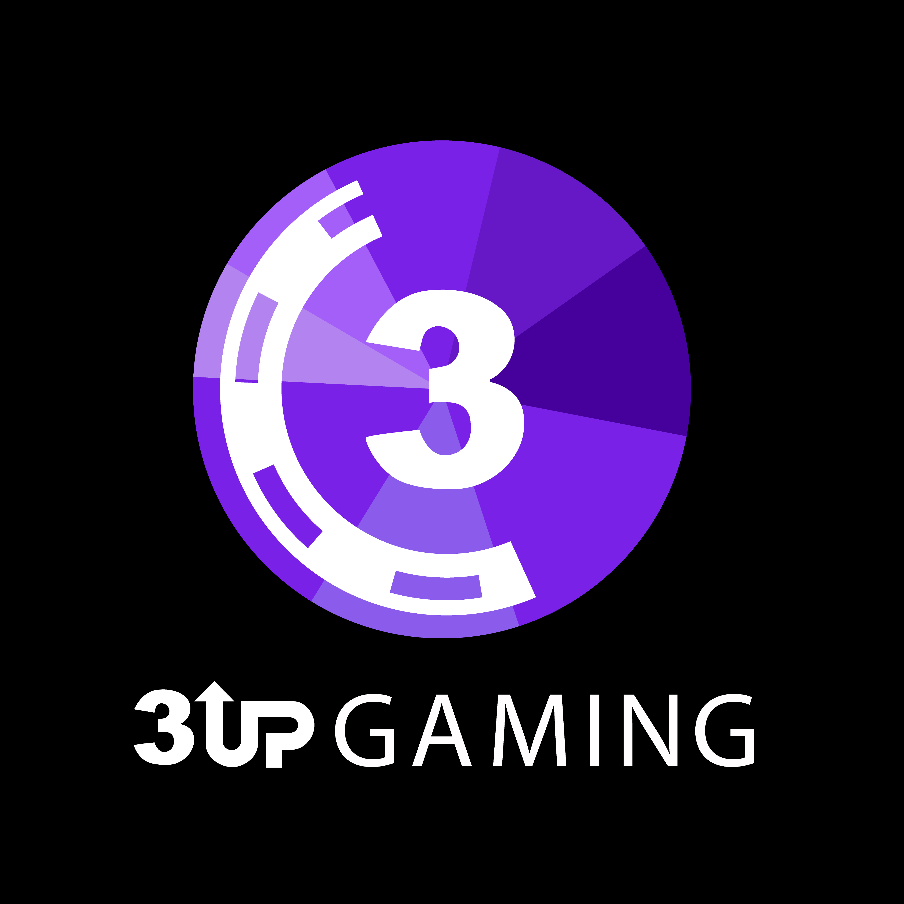

  

  <h1>3UP Gaming</h1>
  
<strong>Powering the next generation of online poker.</strong> 
  Secure, customizable poker software and iGaming solutions built for ambitious operators.

  

    
    
  

---

## Built to launch. Designed to scale.

From a focused poker product to a complete turnkey operation, 3UP Gaming gives operators the technology, flexibility, and support to create memorable player experiences across **web, desktop, mobile, and PWA**.

## Our solutions

| Solution | Best for | Learn more |
| --- | --- | --- |
| **Poker Platform** | A scalable, real-time foundation for online poker | [Explore the platform](https://3upgaming.com/poker-platform/) |
| **Poker API** | Connecting poker functionality to your product and operations | [View the API](https://3upgaming.com/poker-api/) |
| **Standalone Poker** | Launching an independent poker operation | [Get started](https://3upgaming.com/standalone-poker/) |
| **Poker Skin** | Creating a distinctive, branded player experience | [Build your skin](https://3upgaming.com/poker-skin/) |
| **Poker Network** | Building and managing a connected poker ecosystem | [Discover networks](https://3upgaming.com/poker-network/) |
| **White Label Poker** | Launching under your brand with our technology behind it | [See white label](https://3upgaming.com/whitelabel/) |
| **Crypto & NFT Poker** | Exploring blockchain-enabled gaming experiences | [Crypto Poker](https://3upgaming.com/crypto-poker/) · [NFT Poker](https://3upgaming.com/nft/) |

## Why operators choose 3UP

- **Player-first experiences** — configurable game types, tournament formats, table designs, loyalty features, and branded front ends.
- **Operational control** — back-office tools for player management, reporting, bonuses, affiliates, and multi-currency operations.
- **Ready for every market** — fiat and crypto payment integrations, anti-fraud capabilities, regular updates, and ongoing support.
- **Flexible by design** — licensing models that support both ownership and rental, helping you choose the right path for your business.

## Explore 3UP Gaming

| Company | Products & insights | Resources |
| --- | --- | --- |
| [About Us](https://3upgaming.com/about-us/) | [Products](https://3upgaming.com/products/) | [Presentation](https://3upgaming.com/presentation/) |
| [Blog](https://3upgaming.com/blog/) | [News](https://3upgaming.com/all/news/) | [Catalog](https://3upgaming.com/catalog/) |
| [Guides](https://3upgaming.com/all/guids/) | [Strategy](https://3upgaming.com/all/strategy/) | [Share Feedback](https://3upgaming.com/elementor-21283/) |

## Ready to deal in?

Whether you are launching a new poker brand, extending an existing gaming portfolio, or planning a broader iGaming ecosystem, our team can help shape the right solution for your market and business model.

  
  

## Connect with 3UP Gaming

[LinkedIn](https://www.linkedin.com/company/3upgaming/) · [Instagram](https://www.instagram.com/3up__gaming/) · [Facebook](https://www.facebook.com/profile.php?id=61582148859249) · [Telegram News](https://t.me/threeupgamingnews) · [WhatsApp](https://wa.me/15109943477) · [YouTube](https://www.youtube.com/@3upgaming-g2x) · [X](https://x.com/3UPGamiing)